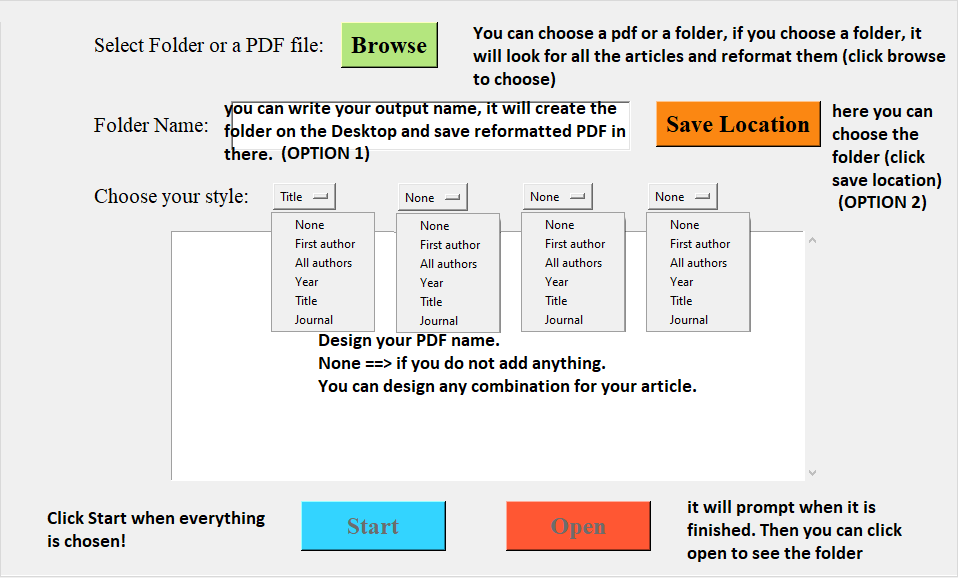

# Article-Formatter
Provide renaming randomly named articles. Provide desired formatting and organize your articles.



You can design any format of your articles.

It uses Pubmed database via "BioPython" to check Meta data of publish article and/Or Meta data of the PDF files via "PyPDF2". If the article is not published or not having proper META data in the PDF files. It will not yield proper results (mostly None). Therefore BioRxiv files are not fully supported!

Video description how to install and use it (Youtube):

[](https://www.youtube.com/watch?v=Zc78L8_r6Cg "Video description how to install and use it")

Python install codes for MAC and Linux:
```
python -m pip install -r requirements.txt  #install packages
python main.py  #run the program

# you might need to run python3 instead python in mac and linux system.
```

It is under MIT copyright. You can use it and share with others. 

If you find it useful and wants me to improve, please reach out! You can also support me via https://www.buymeacoffee.com/science64
